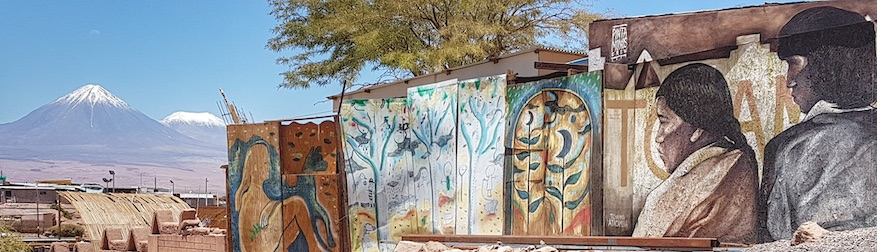

<meta name="citation_title" content="Askemata: referências em ciências humanas">
<meta name="citation_author" content="Miotto, M.">
<meta name="citation_date" content="2021/09/01">
<meta name="citation_journal_title" content="(site web)">
<meta name="citation_volume" content="0">
<meta name="citation_issue" content="20">
<meta name="citation_firstpage" content="0">
<meta name="citation_pdf_url" content="https://askemata.github.io/recursos1/">

Recursos *web* para Humanidades
========================

Recursos
--------

Recursos *web* públicos, gratuitos e *open source* de interesse para pesquisadores em ciências humanas.  

Voltar para o [index](https://askemata.github.io).

Dicionários 
----- 

- [Dict.cc](https://www.dict.cc/): alemão
- [Google Translator](https://translate.google.com/): diversos
- [Linguee](https://www.linguee.com/): diversos
- [Reverso](https://woerterbuch.reverso.net/deutsch-definition/): diversos
- [Transliterate](http://transliterate.com/): transliteração grego-latim

Diretórios 
----- 

- [Z-library](https://z-lib.org/) 

Ferramentas Web 
----- 

- [Awesome Academic Writing](https://maehr.github.io/awesome-academic-writing/) 
- [MdWiki](http://dynalon.github.io/mdwiki/#!index.md) 
- [Stylo](https://stylo.huma-num.fr): confecção e exportação em Markdown

Latex
----- 

- [Tipografia para Latex](https://tex.stackexchange.com/questions/1319/showcase-of-beautiful-typography-done-in-tex-friends) 

Linux 
----- 

- [Boomaga](http://www.boomaga.org/download/): impressora virtual

Processadores de texto 
----- 

- [FreeOffice](https://www.freeoffice.com/pt/) 
- [LibreOffice](https://pt-br.libreoffice.org/) 

Zotero 
----- 

- [ZoteroBib](https://zbib.org): Gerador instantâneo de bibliografia baseado no Zotero. 
- [Plugins](https://www.zotero.org/support/plugins): Lista de Plugins para Zotero.
- [Zotfile](http://zotfile.com/): manage your attachments: automatically rename, move, and attach PDFs (or other files) to Zotero items

> "Le poète ne retient pas ce qu’il découvre ; l’ayant transcrit, le perd bientôt. En cela réside sa nouveauté, son infini et son péril"
> René Char, La Bibliothèque est en feu (1956)

Achtung! A lista de menus, acima, distribui o conteúdo. (*Work in progress*)

